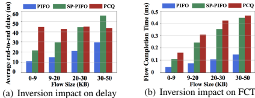

# Sift

**标题**: [Sifter: An Inversion-Free and Large-Capacity Programmable Packet Scheduler](https://www.usenix.org/system/files/nsdi24-gao-peixuan.pdf)

## 研究背景

包调度器在决定数据包服务顺序方面起着关键作用，通过为每个包根据其Rank来排序。然而，在高包速率下处理大量流时，排序操作变得极其复杂且耗时。现有近似调度器（如PCQ、SP-PIFO等）通过牺牲精度换取了扩展性和低资源消耗，但会引入**包反转（Packet Inversion）**，即包的实际调度顺序与Rank顺序不一致，导致吞吐量波动、公平性下降、延迟增加及流完成时间延长，尤其对远程手术、自动驾驶等低延迟应用产生严重影响。

## 现有工作挑战

1. **超高速度下的优先级队列实现困难**  
   - 每包处理时间极短（例如100Gbps链路上64字节包处理时间＜7ns）
   - 精确调度器（如PIFO、Sequencer）通过牺牲缓存容量换取低时间复杂度，但容量有限
   - 近似调度器（如PCQ、SP-PIFO）通过FIFO队列结构降低复杂度，但引入包反转错误

2. **包反转的负面影响**  
   - 定义：包调度顺序未严格按Rank值递增（存在Rank值大的包先于Rank值小的包被调度）
   - 导致后果：
     - 吞吐量波动与短期公平性失衡
     - 虚拟时钟类算法（如SFQ）因时间戳跳跃造成新流饥饿
     - 延迟敏感应用（如V2X）无法满足截止时间要求
     - 流完成时间（FCT）显著增加

    

3. **理想调度器的需求矛盾**  
   - 需同时满足：高精度（无反转）、大容量、低资源开销
   - 现有方案无法兼顾三者（如PIFO精度高但容量小，PCQ容量大但精度低）

## 提出的方法：Sifter

Sifter是一种**无反转、大容量、可编程包调度器**，核心创新点包括：

1. **混合架构设计**  
   - **Mini-PIFO**：精确排序小Rank包（类似PIFO但规模小）
   - **旋转日历队列（RCQ）**：粗粒度排序大Rank包（基于FIFO队列组）
   - 通过**Sentinel机制**动态控制包进入Mini-PIFO的阈值

2. **Sift Sorting算法**  
   - 并行执行**入队、出队、筛选（Sifting）** 过程
   - 利用**加速因子（Speed-up Factor）**（内存带宽与输出带宽比）实现无阻塞并行排序

3. **严格无反转保证**  
   - 通过数学条件（公式3、6）确保Mini-PIFO始终包含最小Rank包
   - 满足：$Th_S \cdot K \geq S_F$ 且 $S_P \geq 2 \cdot Th_S$（其中$Th_S$为筛选阈值，$K$为加速因子，$S_F$为FIFO大小，$S_P$为Mini-PIFO大小）

    

## 实现思路与方法

### 核心组件与工作流程

```plaintext
1. 包描述符（72位）进入调度器
2. Enqueue过程：
   - 若Rank ≤ Sentinel值 → 插入Mini-PIFO（若满则驱逐最大Rank包至RCQ）
   - 否则 → 存入RCQ对应FIFO（通过位切片快速索引）
3. Dequeue过程：
   - 始终从Mini-PIFO头部取出最小Rank包
4. Sifting过程：
   - 当Mini-PIFO占用率低于阈值时，从RCQ最早非空FIFO迁移所有包至Mini-PIFO
   - 迁移过程中Mini-PIFO满时反向驱逐包至RCQ
```


### 伪代码摘要（Algorithm 1）

```python
function ENQUEUE(Packet P):
    if P.rank ≤ Sentinel:
        Mini-PIFO.insert(P)  # 可能驱逐包至RCQ
    else:
        RCQ.insert(P)

function DEQUEUE():
    packet = Mini-PIFO.pop()
    if Mini-PIFO.occupancy ≤ Th_S:
        SIFTING()  # 触发筛选

function SIFTING():
    FIFO = RCQ.find_earliest_non_empty()
    Sentinel = FIFO.max_rank
    for packet in FIFO:
        if packet.rank ≤ Sentinel:
            Mini-PIFO.insert(packet)  # 可能反向驱逐
        else:
            RCQ.reinsert(packet)
```

### 硬件优化特性

- **快速RCQ索引**：通过Rank位切片直接计算FIFO索引（免乘法计算）
- **并行操作**：支持同时push/pop操作
- **Sentinel动态更新**：确保Mini-PIFO始终持有最小Rank包

---

## 验证与实验

### 1. NS3模拟验证

- **公平性测试**（8条TCP流）：  
  Sifter收敛速度与理想PIFO相当，而PCQ/SP-PIFO出现明显吞吐波动
  
- **大规模数据中心测试**（256节点Fat-Tree）：
  - 使用SFQ（公平队列）和Modified SRPT（最小化FCT）算法
  - Sifter在FCT和尾延迟表现接近理想PIFO，显著优于PCQ/SP-PIFO
  
### 2. FPGA硬件原型

- **平台**：Xilinx Alveo U250（XCU13P FPGA）
- **性能**：
  - 运行频率：322 MHz
  - 支持线速：100Gbps（包长≥370字节）
  - 资源占用：<1.25% FPGA资源
- **无反转验证**：实际流量测试中包调度顺序严格按Rank递增
  
### 3. 设计参数影响

- **FIFO大小（$S_F$）**：增大可减少溢出（图17a）
- **Mini-PIFO大小（$S_P$）**：增大可降低筛选频率（图17b）
- **资源开销**：FIFO数量增加至128仅占FPGA资源3.3%（图18c）

## 包调度器（Packet Scheduler）与包调度算法（Packet Scheduling Algorithm）的区别

包调度器与包调度算法是网络数据平面中密切相关但本质不同的两个概念。根据文档内容，它们的核心区别如下：

### 1. **功能定位不同**

- **包调度算法**：  
  属于**计算逻辑层**，负责定义包调度的**策略和目标**。它根据特定目标（如公平性、低延迟、最小化流完成时间等）为每个数据包计算一个**秩（Rank）**，该秩值决定了包的理论调度顺序。  
  📌 *示例算法*：  
  - **SFQ（Start-time Fair Queuing）**：实现加权最大最小公平带宽分配  
  - **Modified SRPT**：最小化流完成时间（FCT）  
  - **Delay-Guarantee算法**：为包分配“松弛时间”以满足截止期限  

- **包调度器**：  
  属于**执行层**，是硬件或软件实现的**排序引擎**。它不关心秩的计算逻辑，只负责根据算法给定的秩值**对包进行实际排序和输出**。  
  📌 *示例调度器*：  
  - **PIFO（Push-In First-Out）**：严格按秩排序（但容量小）  
  - **PCQ/SP-PIFO**：基于FIFO的近似排序（有反转错误）  
  - **Sifter**：无反转的大容量排序器（结合Mini-PIFO与RCQ）  

### 2. **实现层次分离**

文档第2.1节（Programmable Packet Scheduling）明确指出：  
> “可编程包调度的抽象涉及两个关键步骤：  
> (1) **确定每个包的调度顺序（秩计算）**  
> (2) **强制执行该顺序（秩排序）**”  

- **算法负责步骤(1)**：通常在终端主机或交换机流水线入口编程实现（如计算虚拟时间戳、剩余流量大小等）。  
- **调度器负责步骤(2)**：在交换机输出端口或调度模块中实现，需满足高速处理需求（如100Gbps下每包处理时间＜7ns）。  

### 3. **可编程性与通用性**

- **算法可编程**：  
  同一调度器可通过支持不同秩计算方式（如时间戳、剩余大小、截止时间）实现多种调度目标（公平性、低FCT、延迟保证）。  
  > *文档第2.1节*：  
  > “通用调度器通过按秩升序服务包，可实现特定调度算法定义的顺序。”

- **调度器通用性**：  
  如Sifter这类调度器不依赖特定算法，只要提供秩值即可工作（文档第4节：Sifter支持通过预计算秩值编程实现SFQ、SRPT等）。  

### 4. **性能挑战侧重点**

- **算法挑战**：  
  秩计算的正确性（如虚拟时钟更新需避免因包反转导致的时间戳跳跃问题——文档2.2.1节指出：SFQ若发生反转会导致新流饥饿）。

- **调度器挑战**：  
  排序操作的**速度与精度权衡**。例如：  
  - 理想PIFO精度高但容量小  
  - FIFO基调度器（如PCQ）容量大但引入反转  
  - Sifter通过混合结构兼顾两者（第3.1节）  

### 5. **错误影响不同**

- **算法错误**：  
  导致策略目标失效（如不公平带宽分配、FCT增加）。  
  *文档图1*：  
  
- **调度器错误**：  
  指**包反转**（Packet Inversion），即实际输出顺序与秩顺序不一致（文档2.2节定义）。反转会放大算法本身的误差，尤其对延迟敏感应用（如远程手术）产生严重后果。

## 总结

包调度算法是**策略制定者**（定义“应该怎么调度”），而包调度器是**策略执行者**（实现“实际怎么调度”）。  
Sifter的贡献在于设计了一个**通用、无反转、大容量的执行引擎**，可准确实现多种算法定义的调度顺序，解决了传统调度器在速度与精度间的矛盾。
